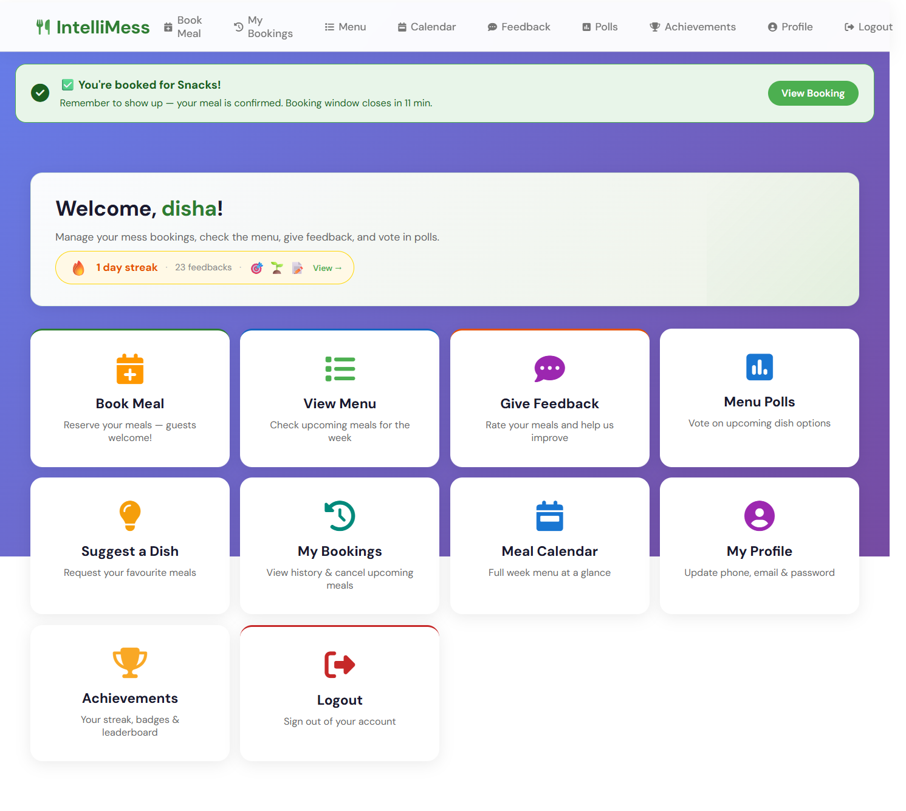
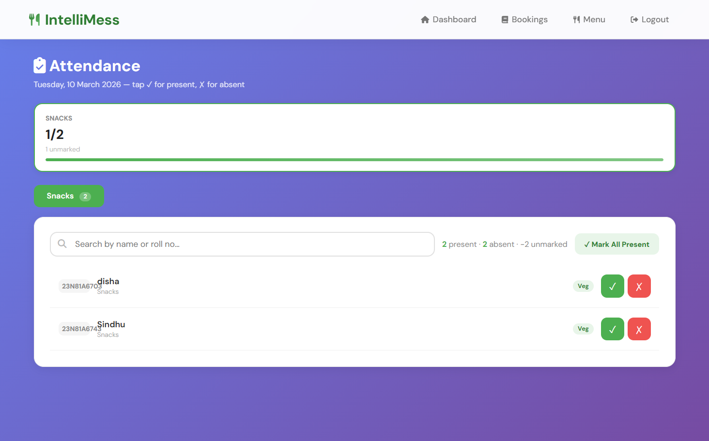
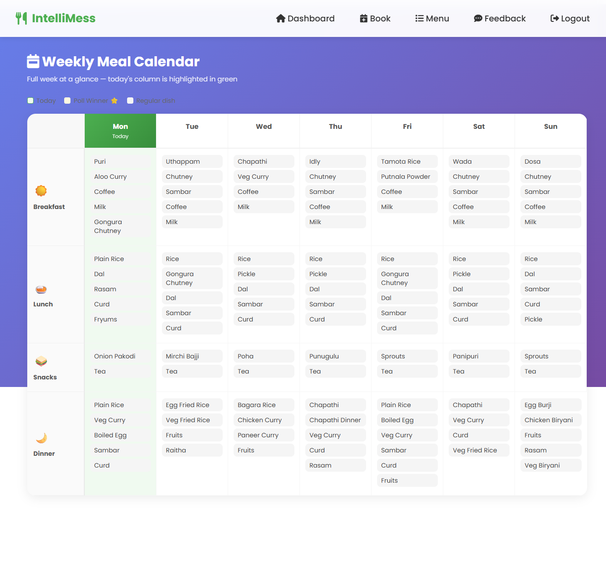
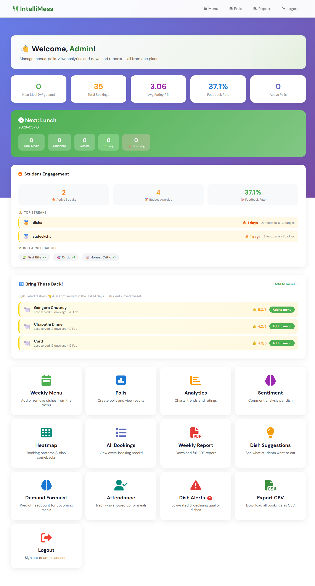
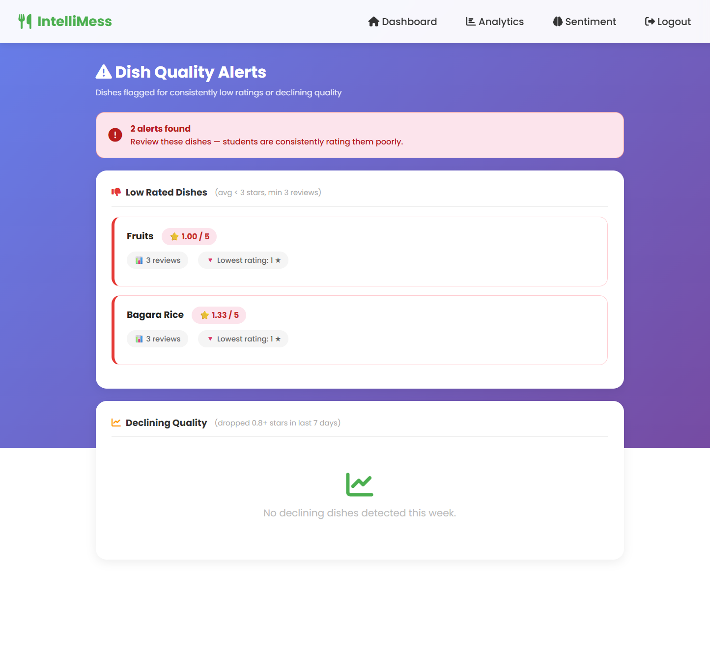
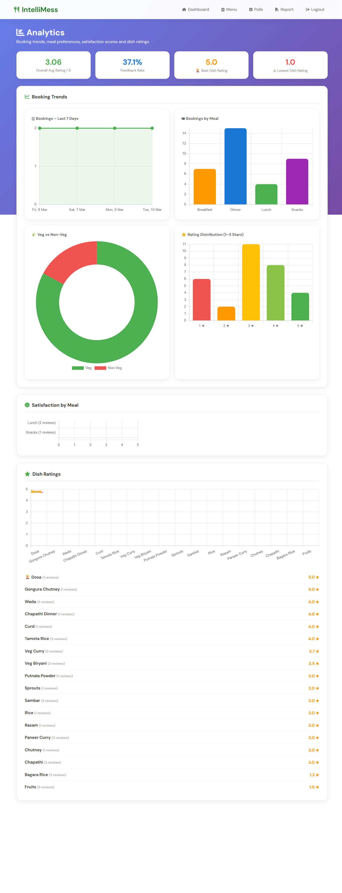

<div align="center">


<br/>

[](https://python.org)
[](https://flask.palletsprojects.com)
[](https://clever-cloud.com)
[](https://apscheduler.readthedocs.io)

<br/>

> **IntelliMess** is a full-stack college mess management platform that replaces paper registers and manual headcounts with real-time bookings, AI-powered dish analytics, tick-based attendance tracking, and automated email reminders — all from a browser.

<br/>

[✨ Features](#-features) · [📸 Screenshots](#-screenshots) · [🚀 Quick Start](#-quick-start) · [📧 Email Setup](#-email-reminders) · [🏗️ Architecture](#-architecture) · [📡 Routes](#-api-routes)

</div>

---

## 💡 The Problem

Every college mess faces the same daily chaos:

| Old Way | IntelliMess Way |
|---|---|
| 📋 Paper booking registers | ✅ Online booking with smart deadlines |
| 🙋 Manual headcounts at mealtime | ✅ Warden ticks each student — one tap per person |
| 🗑️ Food wasted because no one knows demand | ✅ ML demand forecasting |
| 😤 Students eat same food for weeks | ✅ Community polls + dish suggestions |
| 📊 Zero data on what students actually like | ✅ Sentiment analysis + ratings dashboard |
| 📧 No reminders, students forget to book | ✅ Automated email reminders twice per meal |

---

## ✨ Features

### 🎓 Student Portal
- **Meal Booking** — Book Breakfast / Lunch / Snacks / Dinner (Veg/Non-Veg) with guest meals
- **Smart Reminders** — Auto email 30 mins before booking closes *and* 30 mins before meal is served
- **Cancel Bookings** — Cancel today/tomorrow meals before the window closes
- **Meal Calendar** — Full week menu at a glance
- **Feedback & Ratings** — Star-rate each dish, leave comments
- **Community Polls** — Vote for which dish gets served
- **Dish Suggestions** — Suggest new dishes, upvote others
- **Achievements & Streaks** — Gamified badges for consistent feedback

### 🔑 Admin / Warden Portal
- **Attendance Tracker** — Bookings sorted by roll number, tick ✓ or ✗ per student. Search by name/roll. Mark All Present in one click. No page reloads.
- **Low-Rated Dish Alerts** — Flags dishes below 3★ or dropping fast in the last 7 days
- **Demand Forecasting** — GradientBoostingRegressor predicts next week's meal demand
- **Sentiment Analysis** — Rule-based NLP categorises feedback as positive/neutral/negative
- **Analytics Dashboard** — Charts for booking trends, ratings, heatmaps, food type splits
- **Export CSV** — Download all bookings with attendance status in one click
- **Weekly PDF Report** — Auto-generated mess performance report
- **Menu Management** — Set weekly menu, assign dishes per meal slot

---

## 📸 Screenshots

> *(Add screenshots to the `screenshots/` folder in your repo)*

| Student Dashboard | Attendance Tracker | Meal Calendar |
|---|---|---|
|  |  |  |

| Admin Dashboard | Dish Alerts | Analytics |
|---|---|---|
|  |  |  |

---

## 🚀 Quick Start

### Prerequisites
- Python 3.10+
- MySQL database (local or [CleverCloud](https://clever-cloud.com))
- Gmail account with [App Password](https://myaccount.google.com/apppasswords) enabled

### 1. Clone & Install

```bash
git clone https://github.com/dishagupta275/IntelliMess.git
cd IntelliMess
python -m venv venv

# Windows
venv\Scripts\activate

# Mac/Linux
source venv/bin/activate

pip install -r requirements.txt
```

### 2. Configure Environment

Create a `.env` file in the project root:

```env
MYSQL_ADDON_HOST=your-mysql-host
MYSQL_ADDON_DB=your-database-name
MYSQL_ADDON_USER=your-username
MYSQL_ADDON_PORT=3306
MYSQL_ADDON_PASSWORD=your-password

INTELLIMESS_SECRET=your-random-secret-key

MAIL_SENDER=yourgmail@gmail.com
MAIL_PASSWORD=xxxx xxxx xxxx xxxx
```

### 3. Set Up Database

Run the SQL in `migrations_final.sql` on your MySQL database to create all tables.

### 4. Run

```bash
python app.py
```

Open **http://localhost:5000**

---

## 🎫 Attendance System

The warden opens `/admin/attendance` on any browser or phone. Students are listed **sorted by roll number** for the selected meal. The warden taps **✓** (present) or **✗** (absent) next to each name — changes save instantly with no page reload.

**Features:**
- Search bar — filter by name or roll number in real time
- **Mark All Present** button for quick bulk marking
- Tap a tick again to undo (toggle back to unmarked)
- Progress counter: `12 present · 3 absent · 5 unmarked`
- Meal summary cards at the top show attendance % per meal

---

## 📧 Email Reminders

Email reminders are sent via **Gmail SMTP** using a Gmail App Password. This works perfectly when running locally (`python app.py`) since your own internet connection has no SMTP restrictions.

### How to get a Gmail App Password

1. Go to [myaccount.google.com/apppasswords](https://myaccount.google.com/apppasswords)
2. Sign in → Select app: **Mail** → Select device: **Other** → name it `IntelliMess`
3. Copy the 16-character password (format: `xxxx xxxx xxxx xxxx`)
4. Paste it as `MAIL_PASSWORD` in your `.env`

### What gets sent and when

Two background jobs run every 5 minutes via APScheduler:

| Job | Who receives it | When |
|---|---|---|
| **Booking Reminder** | Students who haven't booked yet | 30 min before booking window closes |
| **Attendance Reminder** | Students who have booked | 30 min before meal is served |

Daily schedule (IST):

| Time | Reminder |
|---|---|
| 5:30 AM | Book Breakfast (closes at 6:00 AM) |
| 7:30 AM | Breakfast served soon (served at 8:00 AM) |
| 8:30 AM | Book Lunch (closes at 9:00 AM) |
| 11:30 AM | Book Snacks (closes at 12:00 PM) |
| 12:30 PM | Lunch served soon (served at 1:00 PM) |
| 3:30 PM | Snacks served soon (served at 4:00 PM) |
| 4:00 PM | Book Dinner (closes at 4:30 PM) |
| 7:30 PM | Dinner served soon (served at 8:00 PM) |

Duplicate prevention: each reminder is logged in the `reminder_logs` table with a unique key `(user_id, meal, date, type)` — no student ever gets the same email twice in a day.

> ℹ️ Students can opt out of reminders in their Profile page.

### ⚠️ Email on Hosted Free Tiers (Render / Railway)

**Gmail SMTP does not work on Render or Railway free plans** — both platforms block all outbound SMTP connections (ports 587 and 465). This is a hosting infrastructure restriction, not a code issue.

| Environment | Email works? |
|---|---|
| `python app.py` on your laptop | ✅ Yes — full Gmail SMTP |
| Render free plan | ❌ No — SMTP blocked |
| Railway free plan | ❌ No — SMTP blocked |
| Render paid ($7/month) | ✅ Yes — all ports open |
| Any VPS (DigitalOcean, Hostinger India ₹149/mo) | ✅ Yes |

**For production hosting with email**, options are:
- Upgrade Render to a paid plan ($7/month)
- Use a VPS (Hostinger India starts at ₹149/month)
- Integrate [Google Apps Script](https://script.google.com) as an HTTPS email relay (free workaround)

For **college demos and presentations**, running locally is recommended — emails work perfectly and all other features are identical.

---

## 🏗️ Architecture

```
IntelliMess/
│
├── app.py                   ← Flask app (all routes + scheduler)
├── sentiment.py             ← Rule-based NLP sentiment analysis
├── requirements.txt
├── Procfile                 ← Railway/Heroku start command
├── railway.json             ← Railway deployment config
├── render.yaml              ← Render deployment config
├── migrations_final.sql     ← Full DB schema
├── .env                     ← Local secrets (gitignored)
│
├── static/
│   ├── styles.css           ← Full responsive CSS (mobile + desktop)
│   └── app.js               ← Shared JS (hamburger nav, utilities)
│
└── templates/               ← 25 Jinja2 templates
    ├── login.html / register.html
    ├── student.html          ← Student dashboard
    ├── admin.html            ← Admin dashboard
    ├── admin_attendance.html ← Tick-based attendance tracker
    ├── booking.html          ← Meal booking form
    ├── calendar.html         ← Weekly meal calendar
    ├── admin_analytics.html  ← Charts & trends
    ├── admin_alerts.html     ← Low-rated dish alerts
    ├── admin_forecast.html   ← ML demand forecasting
    └── ...
```

### Tech Stack

| Layer | Technology |
|---|---|
| Backend | Python 3 + Flask |
| Database | MySQL (CleverCloud) |
| Frontend | Jinja2 + Vanilla JS + CSS (DM Sans) |
| ML | scikit-learn (GradientBoostingRegressor) |
| Email | Gmail SMTP via smtplib |
| Scheduler | APScheduler (BackgroundScheduler, 5-min interval) |
| PDF Reports | ReportLab |
| Deployment | Render / Railway (gunicorn, 1 worker) |

---

## 📡 API Routes

<details>
<summary><b>Student Routes</b></summary>

| Method | Route | Description |
|---|---|---|
| GET/POST | `/register` | Registration |
| GET/POST | `/login` | Login |
| GET | `/student` | Dashboard with booking reminder banner |
| GET/POST | `/booking` | Book a meal |
| GET | `/my-bookings` | View & cancel bookings |
| POST | `/cancel-booking/<id>` | Cancel a booking |
| GET | `/calendar` | Weekly meal calendar |
| GET/POST | `/feedback` | Rate dishes |
| GET/POST | `/polls` | Vote in polls |
| GET/POST | `/suggestions` | Suggest & upvote dishes |
| GET | `/achievements` | Badges & streaks |
| GET/POST | `/profile` | View/edit profile |

</details>

<details>
<summary><b>Admin Routes</b></summary>

| Method | Route | Description |
|---|---|---|
| GET | `/admin` | Dashboard with stats |
| GET/POST | `/admin/menu` | Weekly menu management |
| GET | `/admin/bookings` | All bookings |
| GET | `/admin/attendance` | Tick-based attendance (sorted by roll no.) |
| POST | `/admin/attendance/mark` | Mark present/absent — returns JSON |
| GET | `/admin/analytics` | Charts & trends |
| GET | `/admin/alerts` | Low-rated dish alerts |
| GET | `/admin/forecast` | ML demand forecasting |
| GET | `/admin/sentiment` | Feedback sentiment analysis |
| GET | `/admin/heatmap` | Booking heatmap |
| GET | `/admin/polls` | Manage polls |
| GET | `/admin/suggestions` | Manage dish suggestions |
| GET | `/admin/export/csv` | Download bookings CSV |
| GET | `/admin/report` | Download weekly PDF |
| GET | `/admin/test-email` | Send test email (verify config) |

</details>

---

## ☁️ Deploying

### Render

1. Push to GitHub — `.env` is gitignored ✅
2. Go to [render.com](https://render.com) → **New Web Service**
3. Connect your GitHub repo — Render reads `render.yaml` automatically
4. Add env vars in the Render dashboard:
   ```
   MYSQL_ADDON_PASSWORD
   INTELLIMESS_SECRET
   MAIL_SENDER
   MAIL_PASSWORD
   ```
5. Start command: `gunicorn app:app --workers 1 --timeout 120`

> ⚠️ Email reminders will **not** work on Render free plan. See [Email on Hosted Free Tiers](#️-email-on-hosted-free-tiers-render--railway) above.

> Use [UptimeRobot](https://uptimerobot.com) (free) to ping every 5 minutes to prevent sleeping.

### Railway

1. Push to GitHub
2. [railway.app](https://railway.app) → New Project → Deploy from GitHub
3. Add the same env vars under **Variables**
4. Railway auto-detects the `Procfile` for the start command

> ⚠️ Same SMTP restriction applies on Railway free plan.

### Local (recommended for demos)

```bash
python app.py
```

Everything including email works on localhost. Share via local IP (`http://192.168.x.x:5000`) for same-WiFi demos.

---

## 🗺️ Roadmap

- [ ] Mobile app (React Native) with push notifications
- [ ] UPI payment integration for mess fee
- [ ] Multi-mess support for university campuses
- [ ] WhatsApp bot for booking via chat
- [ ] Student nutrition & diet tracking
- [ ] Production email via Google Apps Script relay (free HTTPS-based)

---

## 🤝 Contributing

Pull requests welcome. For major changes, open an issue first.

```bash
git checkout -b feature/your-feature
git commit -m "Add your feature"
git push origin feature/your-feature
```

---

## 📄 License

MIT License — see [LICENSE](LICENSE) for details.

---

<div align="center">

Built with ❤️ for college students who deserve better mess management.

⭐ **Star this repo if you find it useful!**

</div>
