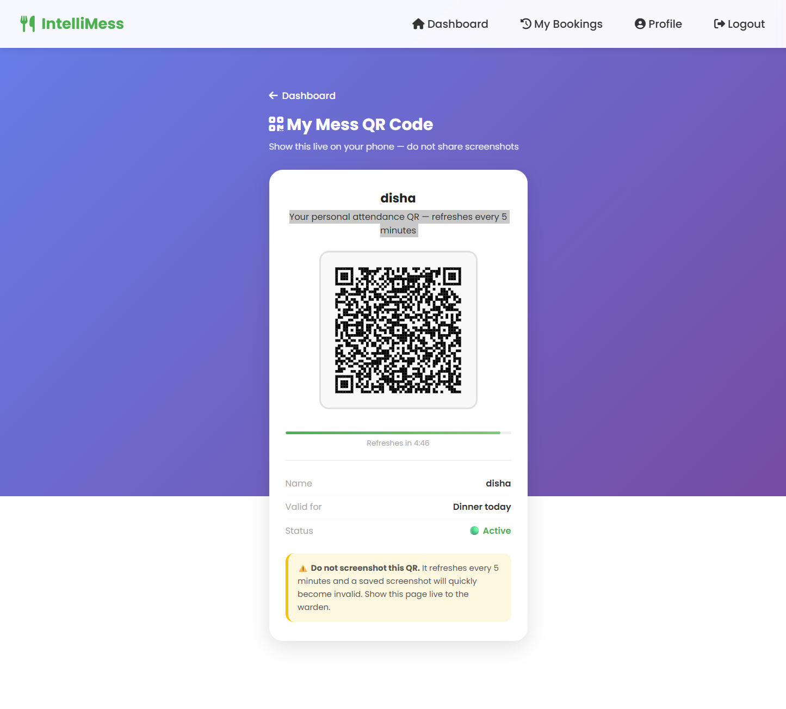
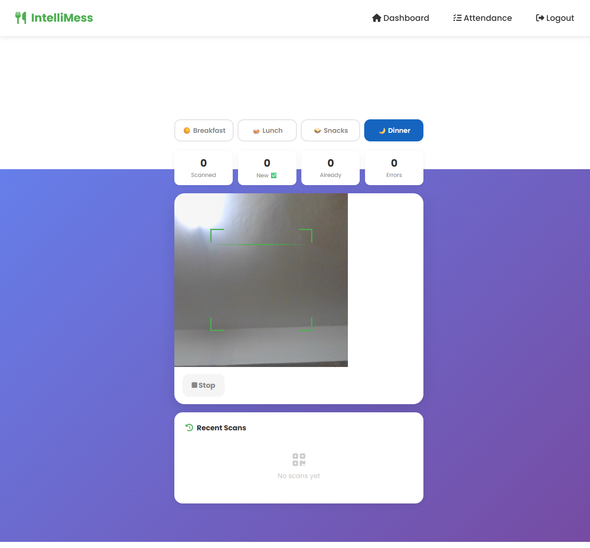

<div align="center">


<br/>

[](https://python.org)
[](https://flask.palletsprojects.com)
[](https://clever-cloud.com)
[](https://apscheduler.readthedocs.io)
[](https://render.com)

<br/>

> **IntelliMess** is a full-stack college mess management platform that replaces paper registers, manual headcounts, and guesswork with real-time bookings, AI-powered dish analytics, time-expiring QR attendance, and automated email reminders — all from a browser.

<br/>

[✨ Features](#-features) · [📸 Screenshots](#-screenshots) · [🚀 Quick Start](#-quick-start) · [🔐 QR System](#-qr-attendance-system) · [🏗️ Architecture](#-architecture) · [📡 Routes](#-api-routes)

</div>

---

## 💡 The Problem

Every college mess faces the same daily chaos:

| Old Way | IntelliMess Way |
|---|---|
| 📋 Paper booking registers | ✅ Online booking with smart deadlines |
| 🙋 Manual headcounts at mealtime | ✅ Warden scans QR → instant attendance |
| 📸 Students share screenshots of QR | ✅ QR expires every 5 min — screenshots useless |
| 🗑️ Food wasted because no one knows demand | ✅ ML demand forecasting |
| 😤 Students eat same food for weeks | ✅ Community polls + dish suggestions |
| 📊 Zero data on what students actually like | ✅ Sentiment analysis + ratings dashboard |
| 📧 No reminders, students forget to book | ✅ Automated email reminders twice per meal |

---

## ✨ Features

### 🎓 Student Portal
- **Meal Booking** — Book Breakfast / Lunch / Snacks / Dinner (Veg/Non-Veg) with guest meals
- **Smart Reminders** — Auto email 30 mins before booking closes *and* 30 mins before meal is served
- **My QR Code** — Time-expiring QR (refreshes every 5 min), screenshot-protected, show live to warden
- **Cancel Bookings** — Cancel today/tomorrow meals before the window closes
- **Meal Calendar** — Full week menu at a glance with poll-winner dishes highlighted
- **Feedback & Ratings** — Star-rate each dish, leave comments
- **Community Polls** — Vote for which dish gets served
- **Dish Suggestions** — Suggest new dishes, upvote others
- **Achievements & Streaks** — Gamified badges for consistent bookings

### 🔑 Admin / Warden Portal
- **QR Scanner** — Browser-based camera scanner, no app needed. Works on any phone over HTTPS.
- **Attendance Tracker** — Today's bookings with bulk-mark, live progress bar, meal tabs. Zero page reloads.
- **Low-Rated Dish Alerts** — Flags dishes below 3★ or dropping fast in the last 7 days
- **Demand Forecasting** — GradientBoostingRegressor predicts next week's meal demand
- **Sentiment Analysis** — Rule-based NLP categorises feedback as positive/neutral/negative
- **Analytics Dashboard** — Charts for booking trends, ratings, heatmaps, food type splits
- **Export CSV** — Download all bookings with attendance status in one click
- **Weekly PDF Report** — Auto-generated mess performance report
- **Menu Management** — Set weekly menu, assign dishes per meal slot

---

## 📸 Screenshots

> *(Drag your screenshots into this section on GitHub to replace the placeholders)*

| Student Dashboard | My QR Code | Warden Scanner |
|---|---|---|
|  |  |  |

| Meal Calendar | Attendance Tracker | Dish Alerts |
|---|---|---|
|  |  |  |

---

## 🚀 Quick Start

### Prerequisites
- Python 3.10+
- MySQL database (local or [CleverCloud](https://clever-cloud.com))
- Gmail account with [App Password](https://myaccount.google.com/apppasswords) enabled

### 1. Clone & Install

```bash
git clone https://github.com/dishagupta275/IntelliMess.git
cd IntelliMess
python -m venv venv

# Windows
venv\Scripts\activate

# Mac/Linux
source venv/bin/activate

pip install -r requirements.txt
```

### 2. Configure Environment

Create a `.env` file in the project root:

```env
MYSQL_ADDON_HOST=your-mysql-host
MYSQL_ADDON_DB=your-database-name
MYSQL_ADDON_USER=your-username
MYSQL_ADDON_PORT=3306
MYSQL_ADDON_PASSWORD=your-password

INTELLIMESS_SECRET=your-random-secret-key

MAIL_SENDER=yourgmail@gmail.com
MAIL_PASSWORD=xxxx xxxx xxxx xxxx
```

### 3. Database Schema

Create your database and set up these tables. The app expects the following structure:

```sql
-- Core users table
CREATE TABLE users (
    id             INT AUTO_INCREMENT PRIMARY KEY,
    username       VARCHAR(80)  NOT NULL UNIQUE,
    password       VARCHAR(200) NOT NULL,
    role           VARCHAR(20)  NOT NULL DEFAULT 'student',
    roll_no        VARCHAR(20)  UNIQUE,
    phone_no       VARCHAR(20),
    email          VARCHAR(120),
    remind_booking TINYINT(1)   NOT NULL DEFAULT 1
);

-- Meal bookings
CREATE TABLE bookings (
    id              INT AUTO_INCREMENT PRIMARY KEY,
    user_id         INT          NOT NULL,
    meal            VARCHAR(20)  NOT NULL,
    food_type       VARCHAR(20)  NOT NULL,
    booking_date    DATE         NOT NULL,
    booking_time    TIME,
    guest_count     INT          DEFAULT 0,
    guest_food_type VARCHAR(20),
    attended        TINYINT(1)   DEFAULT NULL,
    FOREIGN KEY (user_id) REFERENCES users(id) ON DELETE CASCADE
);

-- Weekly menu
CREATE TABLE weekly_menu (
    id          INT AUTO_INCREMENT PRIMARY KEY,
    day_of_week VARCHAR(20) NOT NULL,
    meal        VARCHAR(20) NOT NULL,
    created_at  TIMESTAMP   DEFAULT CURRENT_TIMESTAMP
);

-- Menu items (dishes per slot)
CREATE TABLE menu_items (
    id       INT AUTO_INCREMENT PRIMARY KEY,
    menu_id  INT NOT NULL,
    dish_id  INT NOT NULL,
    FOREIGN KEY (menu_id) REFERENCES weekly_menu(id) ON DELETE CASCADE
);

-- Dishes
CREATE TABLE dishes (
    id        INT AUTO_INCREMENT PRIMARY KEY,
    dish_name VARCHAR(100) NOT NULL UNIQUE
);

-- Feedback & ratings
CREATE TABLE feedback (
    id           INT AUTO_INCREMENT PRIMARY KEY,
    user_id      INT NOT NULL,
    dish_id      INT NOT NULL,
    rating       INT,
    comment      TEXT,
    booking_date DATE,
    created_at   TIMESTAMP DEFAULT CURRENT_TIMESTAMP,
    FOREIGN KEY (user_id) REFERENCES users(id) ON DELETE CASCADE,
    FOREIGN KEY (dish_id) REFERENCES dishes(id) ON DELETE CASCADE
);

-- Polls
CREATE TABLE polls (
    id         INT AUTO_INCREMENT PRIMARY KEY,
    question   VARCHAR(200) NOT NULL,
    meal       VARCHAR(20),
    day_of_week VARCHAR(20),
    created_at TIMESTAMP DEFAULT CURRENT_TIMESTAMP
);

CREATE TABLE poll_options (
    id       INT AUTO_INCREMENT PRIMARY KEY,
    poll_id  INT NOT NULL,
    dish_id  INT NOT NULL,
    FOREIGN KEY (poll_id) REFERENCES polls(id) ON DELETE CASCADE
);

CREATE TABLE poll_votes (
    id        INT AUTO_INCREMENT PRIMARY KEY,
    poll_id   INT NOT NULL,
    option_id INT NOT NULL,
    user_id   INT NOT NULL,
    voted_at  TIMESTAMP DEFAULT CURRENT_TIMESTAMP,
    UNIQUE KEY uq_vote (poll_id, user_id),
    FOREIGN KEY (poll_id)   REFERENCES polls(id) ON DELETE CASCADE,
    FOREIGN KEY (option_id) REFERENCES poll_options(id) ON DELETE CASCADE,
    FOREIGN KEY (user_id)   REFERENCES users(id) ON DELETE CASCADE
);

-- Dish suggestions
CREATE TABLE suggestions (
    id         INT AUTO_INCREMENT PRIMARY KEY,
    user_id    INT  NOT NULL,
    dish_name  VARCHAR(100) NOT NULL,
    reason     TEXT,
    upvotes    INT  DEFAULT 0,
    created_at TIMESTAMP DEFAULT CURRENT_TIMESTAMP,
    FOREIGN KEY (user_id) REFERENCES users(id) ON DELETE CASCADE
);

CREATE TABLE suggestion_votes (
    user_id       INT NOT NULL,
    suggestion_id INT NOT NULL,
    PRIMARY KEY (user_id, suggestion_id),
    FOREIGN KEY (user_id)       REFERENCES users(id)       ON DELETE CASCADE,
    FOREIGN KEY (suggestion_id) REFERENCES suggestions(id) ON DELETE CASCADE
);

-- Email reminder logs (prevents duplicate sends)
CREATE TABLE reminder_logs (
    id            INT AUTO_INCREMENT PRIMARY KEY,
    user_id       INT         NOT NULL,
    meal          VARCHAR(20) NOT NULL,
    reminder_date DATE        NOT NULL,
    reminder_type VARCHAR(20) NOT NULL DEFAULT 'booking',
    sent_at       TIMESTAMP   DEFAULT CURRENT_TIMESTAMP,
    UNIQUE KEY uq_reminder (user_id, meal, reminder_date, reminder_type),
    FOREIGN KEY (user_id) REFERENCES users(id) ON DELETE CASCADE
);
```

### 4. Run

```bash
python app.py
```

Open **http://localhost:5000**

> ⚠️ **QR Scanner requires HTTPS.** Use `localhost` for local testing, or deploy to Render for full phone support.

---

## 🔐 QR Attendance System

### How It Works

Each student's QR encodes a **signed, time-expiring URL**. The token uses HMAC-SHA256 and rotates every 5 minutes — making screenshots permanently useless.

```
QR → https://yourdomain.com/admin/scan/mark?token=42:28591234:a3f9b1c2
                                                   ↑    ↑          ↑
                                                user  5-min    HMAC sig
                                                 id   window
```

### Token Security
- Token = `user_id : time_window : HMAC_signature`
- `time_window` = `unix_timestamp ÷ 300` (changes every 5 minutes)
- Server verifies signature AND checks window is current (±1 window grace = ~10 min)
- Expired tokens are rejected instantly with no fallback

### Screenshot Protection (5 layers)

| Layer | What it blocks |
|---|---|
| ⏱️ QR expires every 5 minutes | Saved screenshot is useless within minutes |
| 🚫 Right-click disabled | "Save image as…" blocked |
| 📱 iOS long-press disabled | Save-to-photos gesture blocked |
| 🌑 Blurs when app is backgrounded | Can't screenshot from app switcher |
| ⌨️ Keyboard shortcuts blocked | PrintScreen, Ctrl+S, Ctrl+P intercepted |

### Warden Scanner

- Opens at `/admin/scan` in any browser
- Auto-detects current meal based on time of day
- Triggers browser camera permission prompt on first use
- Vibrates on each scan (mobile)
- Shows live toast: **"Rahul Kumar · Veg Lunch ✅"**
- Tracks: total scanned / new marks / already marked / errors
- Cooldown prevents double-scanning same QR within 2.5 seconds

> ⚠️ **Camera only works on HTTPS or localhost.** Local IP (`192.168.x.x`) will show a warning. Deploy to Render for full mobile support.

---

## 📧 Automated Email Reminders

Two background jobs run every 5 minutes via APScheduler:

| Trigger | Recipients | Email |
|---|---|---|
| 30 min before booking window closes | Students who **haven't booked** | ⏰ "Book Lunch before it closes!" |
| 30 min before meal is served | Students who **have booked** | 🍽️ "Lunch is in 30 mins — don't forget!" |

Daily reminder schedule:

| Time | Job |
|---|---|
| 5:25 AM | Booking reminder — Breakfast |
| 7:30 AM | Attendance reminder — Breakfast |
| 8:25 AM | Booking reminder — Lunch |
| 12:30 PM | Attendance reminder — Lunch |
| 11:25 AM | Booking reminder — Snacks |
| 3:30 PM | Attendance reminder — Snacks |
| 3:55 PM | Booking reminder — Dinner |
| 7:30 PM | Attendance reminder — Dinner |

---

## 🏗️ Architecture

```
IntelliMess/
│
├── app.py                   ← Flask app (all routes + scheduler + QR)
├── sentiment.py             ← Rule-based NLP sentiment analysis
├── requirements.txt
├── render.yaml              ← One-click Render deployment
├── .env                     ← Local secrets (gitignored)
│
├── static/
│   └── styles.css
│
└── templates/
    ├── student.html          ← Student dashboard
    ├── admin.html            ← Admin dashboard
    ├── my_qr.html            ← Time-expiring QR code page
    ├── admin_scan.html       ← Warden camera scanner
    ├── admin_attendance.html ← Bulk attendance tracker (AJAX)
    ├── booking.html          ← Meal booking form
    ├── calendar.html         ← Weekly meal calendar
    ├── admin_analytics.html  ← Charts & trends
    ├── admin_alerts.html     ← Low-rated dish alerts
    ├── admin_forecast.html   ← ML demand forecasting
    └── ...
```

### Tech Stack

| Layer | Technology |
|---|---|
| Backend | Python 3 + Flask |
| Database | MySQL (CleverCloud) |
| Frontend | Jinja2 + Vanilla JS + CSS |
| ML | scikit-learn (GradientBoostingRegressor) |
| Email | Gmail SMTP via smtplib |
| Scheduler | APScheduler (BackgroundScheduler) |
| QR Generation | qrcode[pil] + HMAC-SHA256 time tokens |
| QR Scanning | jsQR (browser camera, no app needed) |
| PDF Reports | ReportLab |
| Deployment | Render (gunicorn) |

---

## 📡 API Routes

<details>
<summary><b>Student Routes</b></summary>

| Method | Route | Description |
|---|---|---|
| GET/POST | `/register` | Registration with validation |
| GET/POST | `/login` | Login |
| GET | `/student` | Dashboard |
| GET/POST | `/booking` | Book a meal |
| GET | `/my-bookings` | View & cancel bookings |
| POST | `/cancel-booking/<id>` | Cancel a booking |
| GET | `/calendar` | Weekly meal calendar |
| GET/POST | `/feedback` | Rate dishes |
| GET/POST | `/polls` | Vote in polls |
| GET/POST | `/suggestions` | Suggest & upvote dishes |
| GET | `/achievements` | Badges & streaks |
| GET | `/profile` | View/edit profile |
| GET | `/my-qr` | Live time-expiring QR code |
| GET | `/qr-code/<id>.svg` | QR image (served fresh each request) |

</details>

<details>
<summary><b>Admin Routes</b></summary>

| Method | Route | Description |
|---|---|---|
| GET | `/admin` | Dashboard with stats |
| GET/POST | `/admin/menu` | Weekly menu management |
| GET | `/admin/bookings` | All bookings |
| GET | `/admin/attendance` | Today's attendance (AJAX bulk mark) |
| POST | `/admin/attendance/mark` | Mark present/absent — returns JSON |
| GET | `/admin/scan` | QR camera scanner page |
| GET | `/admin/scan/mark` | Verify QR token + mark present |
| GET | `/admin/analytics` | Charts & trends |
| GET | `/admin/alerts` | Low-rated dish alerts |
| GET | `/admin/forecast` | ML demand forecasting |
| GET | `/admin/sentiment` | Feedback sentiment |
| GET | `/admin/heatmap` | Booking heatmap |
| GET | `/admin/polls` | Manage polls |
| GET | `/admin/suggestions` | Manage dish suggestions |
| GET | `/admin/export/csv` | Download bookings CSV |
| GET | `/admin/report` | Download weekly PDF |

</details>

---

## ☁️ Deploying to Render

1. Push to GitHub — `.env` is gitignored ✅
2. Go to [render.com](https://render.com) → **New Web Service**
3. Connect your GitHub repo — Render reads `render.yaml` automatically
4. Add secret env vars in the Render dashboard:
   ```
   MYSQL_ADDON_PASSWORD
   INTELLIMESS_SECRET
   MAIL_SENDER
   MAIL_PASSWORD
   ```
5. Deploy — live in ~3 minutes at `https://intellimess.onrender.com`

> **Free tier:** Use [UptimeRobot](https://uptimerobot.com) (free) to ping every 5 minutes and keep the scheduler alive 24/7.

> **After deploying:** Update the booking link in `app.py` email templates from `http://localhost:5000` to your Render URL.

---

## 🗺️ Roadmap

- [ ] Mobile app (React Native) with push notifications
- [ ] Face recognition as alternative to QR
- [ ] UPI payment integration for mess fee
- [ ] Multi-mess support for university campuses
- [ ] WhatsApp bot for booking via chat
- [ ] Student nutrition & diet tracking

---

## 🤝 Contributing

Pull requests welcome. For major changes, open an issue first.

```bash
git checkout -b feature/your-feature
git commit -m "Add your feature"
git push origin feature/your-feature
```

---

## 📄 License

MIT License — see [LICENSE](LICENSE) for details.

---

<div align="center">

Built with ❤️ for college students who deserve better mess management.

⭐ **Star this repo if you find it useful!**

</div>
